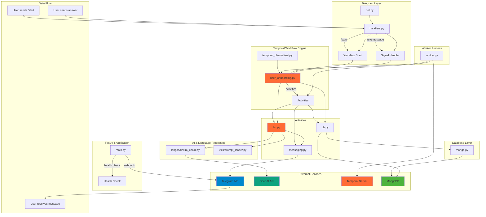

# Полный анализ архитектуры AI Business Buddy Bot

## 🏗️ Архитектурная диаграмма



## 🔄 Детальный поток данных

### 1. Инициализация системы
```
1. FastAPI приложение запускается (main.py)
2. Настраивается webhook для Telegram
3. Подключается роутер handlers
4. Temporal worker запускается отдельно (worker.py)
5. Worker регистрирует workflow и activities
```

### 2. Начало взаимодействия (/start)
```
Пользователь → Telegram API → webhook → handlers.py → 
start_user_workflow() → Temporal Client → 
UserOnboardingWorkflow.run() → 
generate_welcome_message() → LangChain → OpenAI → 
send_message() → Telegram API → Пользователь
```

### 3. Обработка ответов пользователя
```
Пользователь → Telegram API → webhook → handlers.py → 
submit_answer() → Temporal Workflow → 
detect_language() → OpenAI → 
get_next_question() → LangChain → OpenAI → 
send_message() → Telegram API → Пользователь
```

## 🌐 Система определения языка пользователя

### Алгоритм определения языка:

1. **Первоначальный язык**: При старте используется язык из Telegram (`message.from_user.language_code`)

2. **Определение предпочтений**: После первого ответа пользователя:
   ```python
   # В activity llm.py
   @activity.defn
   async def detect_language(text: str) -> str:
       client = AsyncOpenAI(api_key=os.getenv("OPENAI_API_KEY"))
       response = await client.chat.completions.create(
           model="gpt-4o",
           messages=[
               {"role": "system", "content": "You are a language detector."},
               {"role": "user", "content": f"What language the user want to use? Return ISO code only (e.g., en, ru, he): {text}"}
           ],
           temperature=0
       )
       return response.choices[0].message.content.strip()
   ```

3. **Сохранение языка**: Определенный язык сохраняется в MongoDB:
   ```python
   await workflow.execute_activity(
       db.set_user_language,
       args=[int(self.telegram_id), self.language],
       schedule_to_close_timeout=timedelta(seconds=5),
   )
   ```

4. **Использование языка**: Все последующие вопросы генерируются на определенном языке:
   ```python
   context = f"""Ты — AI Business Buddy. Используй следующий промпт для работы:
   {PROMPT_TEXT}
   Язык общения: {language}.
   """
   ```

### Проблемы с определением языка:

1. **Неточность**: AI может неправильно определить язык коротких сообщений
2. **Смешанные языки**: Пользователь может отвечать на разных языках
3. **Отсутствие fallback**: Нет механизма возврата к исходному языку

## ⚠️ Анализ проблем с нестандартным началом

### Что происходит если пользователь не начинает с /start:

1. **Отправка обычного сообщения**:
   ```python
   @router.message(F.text)
   async def handle_text_message(message: types.Message):
       telegram_id = message.from_user.id
       answer_text = message.text.strip()

       client = await get_temporal_client()
       try:
           handle = client.get_workflow_handle(f"user-onboarding-{telegram_id}")
           await handle.signal(UserOnboardingWorkflow.submit_answer, answer_text)
           await message.answer("✅")
       except RPCError as e:
           if "workflow execution already completed" in str(e):
               await message.answer("⚠️ Опрос уже завершён. Напиши /start, чтобы пройти заново.")
           else:
               await message.answer("❌ Произошла ошибка. Попробуйте позже.")
   ```

### Проблемы:

1. **Workflow не существует**: Если пользователь не запустил workflow через /start, попытка получить handle завершится ошибкой
2. **Неправильное состояние**: Даже если workflow существует, он может быть в неподходящем состоянии для получения сигнала
3. **Отсутствие обработки**: Нет логики для создания workflow "на лету"

### Рекомендуемые исправления:

```python
@router.message(F.text)
async def handle_text_message(message: types.Message):
    telegram_id = message.from_user.id
    answer_text = message.text.strip()

    # Проверяем существование пользователя в БД
    existing_user = users_collection.find_one({"telegram_id": telegram_id})
    
    if not existing_user:
        # Пользователь не зарегистрирован - предлагаем начать с /start
        await message.answer("👋 Привет! Начните с команды /start для прохождения опроса.")
        return

    client = await get_temporal_client()
    
    try:
        handle = client.get_workflow_handle(f"user-onboarding-{telegram_id}")
        await handle.signal(UserOnboardingWorkflow.submit_answer, answer_text)
        await message.answer("✅")
    except RPCError as e:
        if "workflow execution already completed" in str(e):
            await message.answer("⚠️ Опрос уже завершён. Напиши /start, чтобы пройти заново.")
        elif "workflow not found" in str(e):
            # Workflow не существует - создаем новый
            user_data = {
                "telegram_id": telegram_id,
                "first_name": message.from_user.first_name,
                "last_name": message.from_user.last_name,
                "username": message.from_user.username,
                "language": message.from_user.language_code or "en",
                "created_at": datetime.now(timezone.utc),
                "answers": [],
                "profile": {},
                "email": None
            }
            await start_user_workflow(user_data)
            await message.answer("🔄 Начинаю новый опрос. Отвечайте на вопросы по порядку.")
        else:
            await message.answer("❌ Произошла ошибка. Попробуйте позже.")
```

## 🏛️ Архитектурные компоненты

### 1. **FastAPI Application** (`main.py`)
- **Роль**: Web-сервер для обработки webhook'ов от Telegram
- **Функции**: 
  - Настройка webhook
  - Обработка входящих запросов
  - Health check endpoint
- **Зависимости**: uvicorn, aiogram

### 2. **Telegram Integration** (`telegram/`)
- **bot.py**: Создание экземпляра бота и диспетчера
- **handlers.py**: Обработчики сообщений
  - `/start`: Инициализация опроса
  - `handle_text_message`: Обработка ответов

### 3. **Temporal Workflow Engine**
- **Роль**: Оркестрация бизнес-логики
- **user_onboarding.py**: Основной workflow опроса
- **Activities**: Модульные задачи
  - `llm.py`: Работа с AI
  - `messaging.py`: Отправка сообщений
  - `db.py`: Работа с базой данных

### 4. **AI & Language Processing**
- **LangChain**: Интеграция с LLM
- **OpenAI GPT-4**: Генерация контента
- **Prompt Engineering**: Структурированные промпты

### 5. **Database Layer**
- **MongoDB**: Хранение данных пользователей
- **Collections**: 
  - `users`: Профили пользователей
  - `langchain_chat_history`: История чатов

### 6. **Worker Process**
- **Роль**: Обработка Temporal задач
- **Регистрация**: Workflows и Activities

## 🔧 Технический стек

| Компонент | Технология | Версия | Назначение |
|-----------|------------|--------|------------|
| Web Framework | FastAPI | 0.116.1 | API сервер |
| Telegram Bot | aiogram | 3.21.0 | Telegram интеграция |
| Workflow Engine | Temporal | 1.15.0 | Оркестрация процессов |
| Database | MongoDB | - | Хранение данных |
| AI Framework | LangChain | 0.3.27 | LLM интеграция |
| AI Model | OpenAI GPT-4 | - | Генерация контента |
| ASGI Server | uvicorn | 0.35.0 | Запуск приложения |

## 📊 Анализ производительности

### Сильные стороны:
1. **Масштабируемость**: Temporal обеспечивает горизонтальное масштабирование
2. **Надежность**: Workflow engine гарантирует выполнение задач
3. **Модульность**: Activities можно переиспользовать
4. **Асинхронность**: Полностью асинхронная архитектура

### Слабые стороны:
1. **Сложность**: Много компонентов для простого бота
2. **Зависимости**: Требует Temporal сервер
3. **Латентность**: Множественные API вызовы
4. **Отладка**: Сложно отследить проблемы в workflow

## 🚀 Рекомендации по улучшению

### 1. **Улучшение определения языка**
```python
@activity.defn
async def detect_language(text: str, telegram_language: str) -> str:
    # Используем несколько методов определения
    methods = [
        lambda: detect_with_openai(text),
        lambda: detect_with_langdetect(text),
        lambda: telegram_language
    ]
    
    for method in methods:
        try:
            result = await method()
            if result in ['en', 'ru', 'he', 'es', 'fr']:
                return result
        except:
            continue
    
    return 'en'  # fallback
```

### 2. **Обработка нестандартных сценариев**
```python
@router.message(F.text)
async def handle_text_message(message: types.Message):
    # Проверяем состояние пользователя
    user_state = await get_user_state(message.from_user.id)
    
    if user_state == "not_started":
        await suggest_start(message)
    elif user_state == "completed":
        await offer_restart(message)
    elif user_state == "in_progress":
        await process_answer(message)
    else:
        await handle_unknown_state(message)
```

### 3. **Мониторинг и логирование**
```python
import logging
from temporalio import activity

@activity.defn
async def send_message(chat_id: int, text: str):
    logger = logging.getLogger(__name__)
    logger.info(f"Sending message to {chat_id}: {text[:50]}...")
    
    try:
        await bot.send_message(chat_id, text)
        logger.info(f"Message sent successfully to {chat_id}")
    except Exception as e:
        logger.error(f"Failed to send message to {chat_id}: {e}")
        raise
```

## 📈 Метрики и мониторинг

### Ключевые метрики для отслеживания:
1. **Время отклика**: От получения сообщения до ответа
2. **Успешность workflow**: Процент завершенных опросов
3. **Определение языка**: Точность определения языка пользователя
4. **Ошибки**: Частота ошибок в различных компонентах
5. **Использование ресурсов**: CPU, память, сеть

### Рекомендуемые инструменты:
- **Prometheus + Grafana**: Метрики и визуализация
- **Jaeger**: Трассировка запросов
- **ELK Stack**: Логирование
- **Sentry**: Мониторинг ошибок 