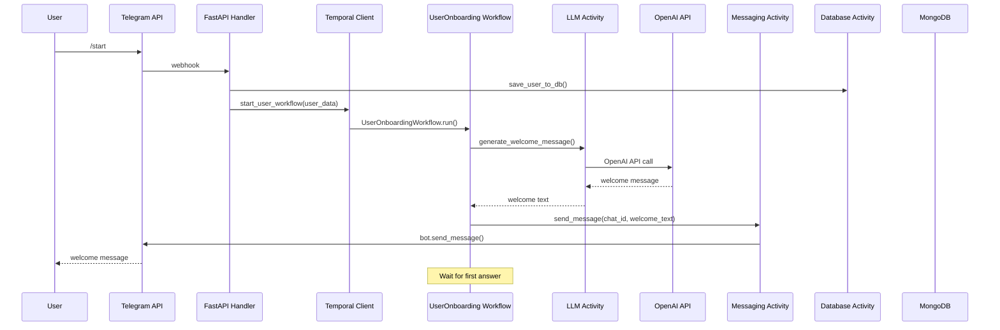
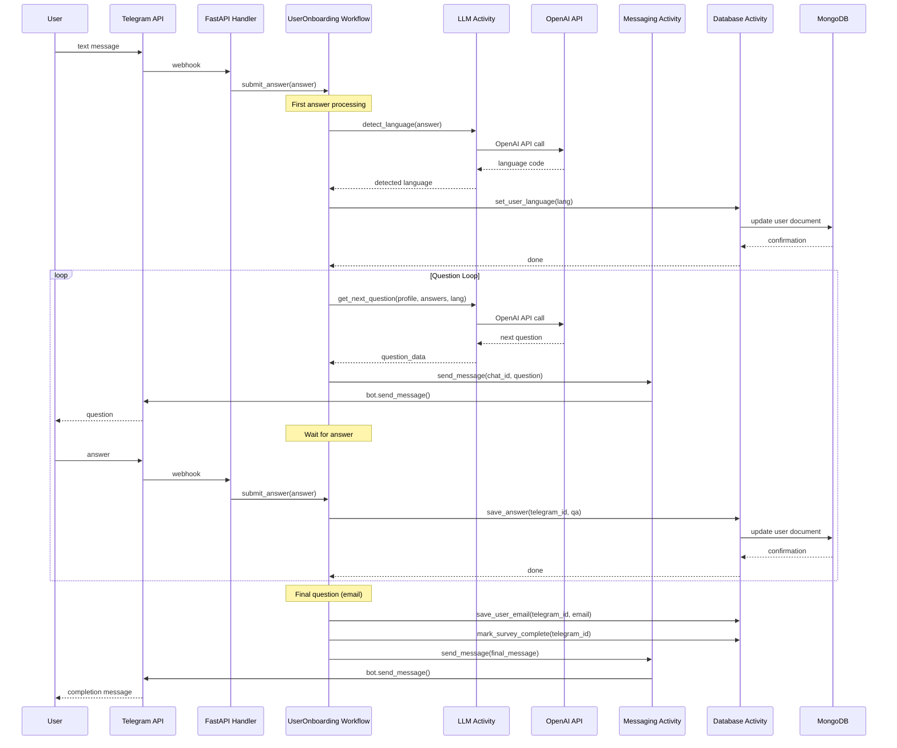
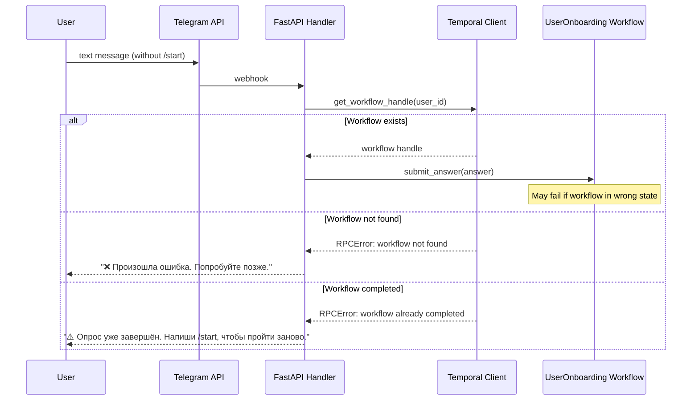
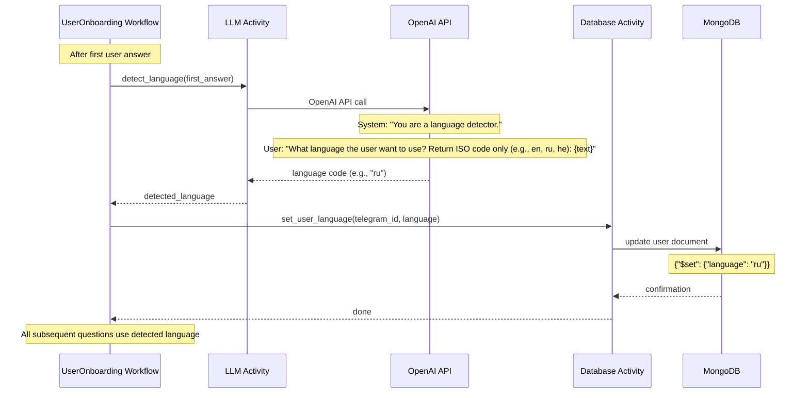
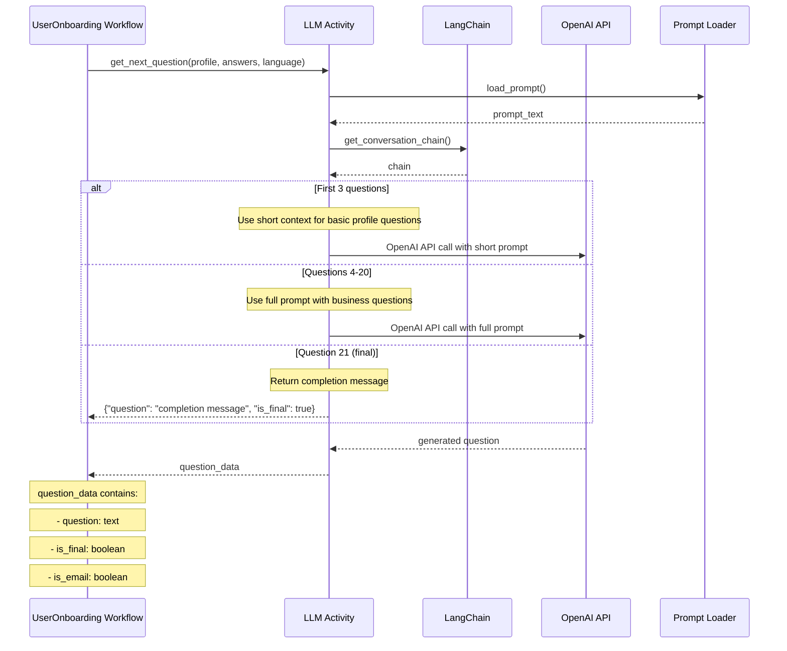
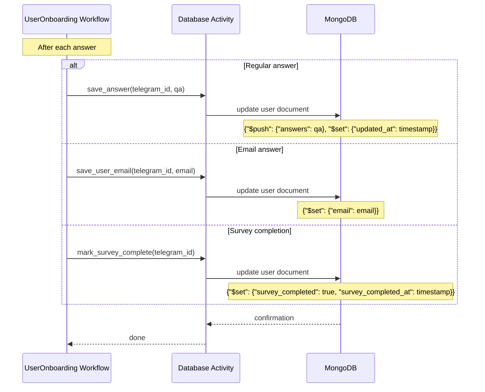
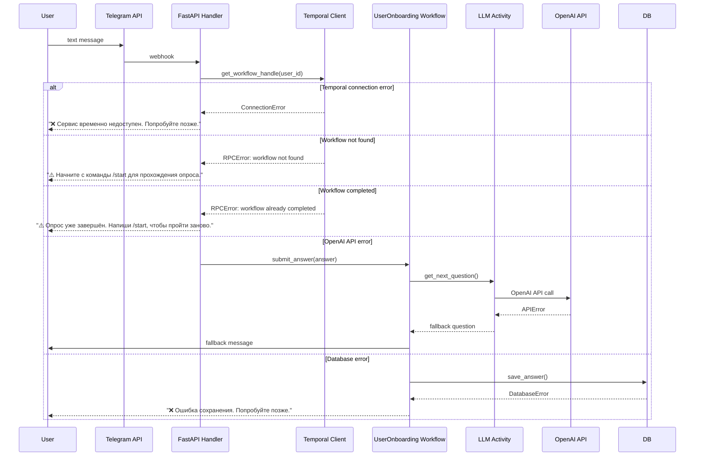

# Диаграммы последовательности AI Business Buddy Bot

## 🔄 Диаграмма последовательности: Начало опроса (/start)

## 🔄 Диаграмма последовательности: Обработка ответа пользователя

## 🔄 Диаграмма последовательности: Проблемный сценарий (без /start)

## 🔄 Диаграмма последовательности: Определение языка

## 🔄 Диаграмма последовательности: Генерация следующего вопроса

## 🔄 Диаграмма последовательности: Сохранение данных

## 🔄 Диаграмма последовательности: Обработка ошибок

## 📊 Статистика компонентов

### Время выполнения (примерные значения):
- **Telegram API**: 100-500ms
- **OpenAI API**: 1-3s
- **MongoDB**: 10-50ms
- **Temporal operations**: 50-200ms
- **LangChain processing**: 500ms-1s

### Частота вызовов:
- **OpenAI API**: ~3-4 calls per user session
- **MongoDB**: ~25-30 operations per user session
- **Telegram API**: ~25-30 calls per user session
- **Temporal signals**: ~20-25 per user session

### Потенциальные узкие места:
1. **OpenAI API latency**: Может замедлить весь процесс
2. **Temporal server**: Центральная точка отказа
3. **MongoDB connection**: При высокой нагрузке
4. **Webhook processing**: FastAPI может стать узким местом 